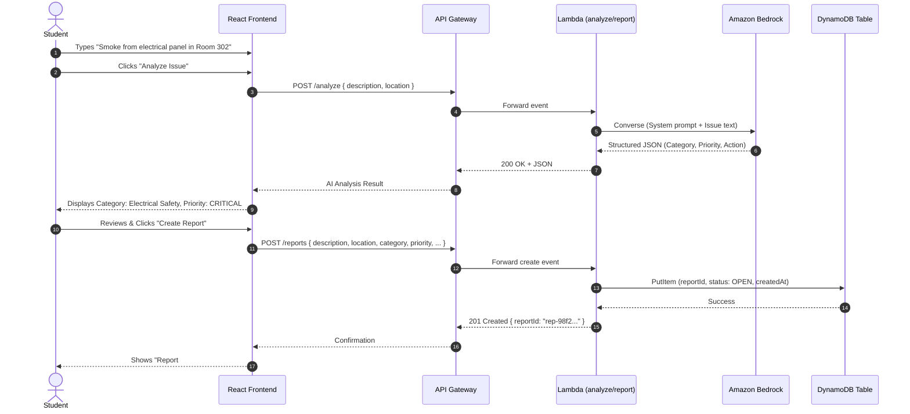

# CampusSOS Technical Architecture

> **Document Status**: Architecture Specification (PART 1 - Foundation & Planning)  
> **Deployment Status**: Planned (No cloud resources deployed during Part 1)  
> **Target Region**: Asia Pacific (Mumbai) - `ap-south-1`

---

## 1. System Overview

**CampusSOS** is an AI-powered campus safety and support reporting platform built for students and campus administrators. When students encounter incidents or hazards—ranging from electrical fires to hostel maintenance or lost ID cards—they often struggle to categorize the issue, assess urgency, or determine the correct department to contact.

CampusSOS solves this by allowing students to describe issues in plain, natural language. An integrated AI pipeline powered by **Amazon Bedrock** classifies the category, assigns a standardized urgency priority, produces an objective incident summary, and returns an immediate safety recommendation. The student reviews this structured analysis and confirms submission, creating an actionable incident record stored in **Amazon DynamoDB** for administrators to triage, assign, and resolve.

---

## 2. High-Level Architecture Diagram

```mermaid
flowchart TD
    subgraph Client["Client Layer (Student & Admin Browsers)"]
        UI["React 18 + TypeScript (Vite Single Page App)"]
    end

    subgraph Hosting["AWS Hosting"]
        Amplify["AWS Amplify Hosting (Global CDN / S3)"]
    end

    subgraph APILayer["API & Edge Gateway"]
        APIGW["Amazon API Gateway (REST API / CORS)"]
    end

    subgraph Compute["Serverless Backend"]
        L_Analyze["AWS Lambda: analyzeIssue"]
        L_Reports["AWS Lambda: manageReports"]
    end

    subgraph AI["Generative AI Layer"]
        Bedrock["Amazon Bedrock (Amazon Nova / Titan / Claude)"]
    end

    subgraph Database["Data Persistence"]
        DDB[("Amazon DynamoDB: CampusSOS-Reports\n(On-Demand Pay-Per-Request)")]
    end

    subgraph FutureS3["Optional Future Storage (Phase 9)"]
        S3[("Amazon S3: Incident Evidence Attachments")]
    end

    UI -->|Static Asset Fetch| Amplify
    UI -->|HTTPS REST Calls| APIGW
    APIGW -->|POST /analyze| L_Analyze
    APIGW -->|POST, GET, PATCH /reports| L_Reports

    L_Analyze -->|Converse / InvokeModel| Bedrock
    L_Reports -->|PutItem, Query, Scan, UpdateItem| DDB
    L_Reports -.->|Presigned URLs (Future)| S3
```

---

## 3. Frontend Architecture

- **Framework**: React 18 with TypeScript.
- **Build Tool**: Vite for rapid development and lightweight bundles.
- **Design System**: Vanilla CSS tokens (CSS Variables) prioritizing:
  - Clean typography, high contrast, and accessible UI (WCAG AA).
  - Modern aesthetic with subtle glassmorphism and crisp visual hierarchy.
  - Mobile-responsive layout for on-the-go student submissions.
  - No bloated CSS frameworks to maintain complete styling control and minimal bundle size.
- **Client State**:
  - `IssueSubmissionContext`: Holds active issue draft, AI analysis response, validation state, and submission progress.
  - `AdminViewContext`: Holds filter criteria (status, priority), cached report queries, and selection state.
- **API Client**: Modular fetch wrapper with centralized error handling, request timeouts, and automatic JSON parsing.

---

## 4. Backend Architecture

- **Runtime**: Node.js 20.x on AWS Lambda (Serverless).
- **Execution Model**: Event-driven micro-handlers matching API Gateway routes.
- **Layered Architecture & Separation of Concerns**:

```
Frontend (React 18 + Vite SPA)
       |
       | [Live HTTP Requests - Part 4 Integrated]
       v
Local HTTP Server (localDevServer.ts)  --> [Future Phase 10: Amazon API Gateway]
       |
AWS Lambda Handlers (analyze.ts, createReport.ts, listReports.ts, getReport.ts, updateReportStatus.ts)
       |
       v
Service Layer
 ├── AnalysisService
 │     ├── MockAnalysisService       <-- [Local Dev Implementation - Part 4]
 │     └── BedrockAnalysisService    <-- [Current AWS Implementation - Part 6]
 └── ReportService
       ↓
  ReportRepository
       ├── InMemoryReportRepository  <-- [Local Dev Implementation - Part 4]
       └── DynamoDBReportRepository  <-- [Current AWS Implementation - Part 5]
```

### Key Modules Implemented (Part 3):
1. `analyze.ts`: Accepts natural language text, validates bounds (10–2000 chars), invokes `AnalysisService`, and returns structured JSON output.
2. `createReport.ts`: Validates all required fields, generates collision-resistant `CS-2026-XXXX` report ID, sets initial status to `OPEN`, and persists via `ReportService`.
3. `listReports.ts`: Supports filtering by `status` and `priority`, returning sorted incident lists.
4. `getReport.ts`: Point lookup for a single report by ID. Returns 404 if not found.
5. `updateReportStatus.ts`: Validates status transitions (`OPEN` -> `IN_PROGRESS` -> `RESOLVED`), updates `updatedAt` timestamp, and prevents invalid backward transitions (e.g. `RESOLVED` -> `OPEN`).

### Prompt Injection & Untrusted Data Boundary:
- The backend treats all student inputs as **untrusted data**.
- The AI layer is architected such that user text is injected strictly within isolated data markers (e.g. `<student_report>...</student_report>`).
- User input is never evaluated as code, and system safety constraints cannot be overridden by text inside the report description.

---

## 5. API Architecture

All endpoints communicate via standard HTTPS JSON payloads through Amazon API Gateway.

| Method | Endpoint | Description | Auth / Access |
|---|---|---|---|
| `POST` | `/analyze` | Sends issue text to Bedrock AI; returns category, priority, summary, and action | Public (Student) |
| `POST` | `/reports` | Persists confirmed report into DynamoDB; returns generated `reportId` | Public (Student) |
| `GET` | `/reports` | Lists submitted reports with optional `status` filter | Admin |
| `GET` | `/reports/{id}` | Retrieves full incident record by `reportId` | Admin / Student |
| `PATCH` | `/reports/{id}/status` | Updates incident status (`OPEN`, `IN_PROGRESS`, `RESOLVED`) | Admin |

*(See [api_contract.md](file:///d:/CampusSOS/docs/api_contract.md) for full schema specifications).*

---

## 6. AI Architecture & Safety Guardrails

### 6.1 Model Selection
- Primary: **Amazon Nova Micro / Lite** (or Amazon Titan Text Premier / Anthropic Claude 3 Haiku depending on availability in `ap-south-1`).
- Cost-conscious selection: Low-latency, cost-effective inference ideal for classification and extraction tasks.

### 6.2 Output Contract
Amazon Bedrock is instructed to respond strictly in valid JSON conforming to:
```json
{
  "category": "Electrical Safety",
  "priority": "CRITICAL",
  "summary": "Smoke has been reported from an electrical panel.",
  "recommendedAction": "Move away from the affected area and contact appropriate campus emergency or maintenance personnel. Do not attempt electrical repair.",
  "department": "Campus Safety / Maintenance"
}
```

### 6.3 Safety & Ethics Principles (Non-Negotiable)
1. **Routing Assistant, Not Emergency Dispatcher**: The AI is explicitly informed it is a triage and routing tool. It must never give do-it-yourself repair guidance on dangerous items (e.g., high voltage, chemical spills, gas leaks, structural collapse).
2. **De-escalation and Life Safety First**: For critical hazards (smoke, sparks, physical danger), the primary recommendation must direct individuals to evacuate and notify trained emergency staff.
3. **Presumption of Innocence / Objective Reporting**: The AI must never validate or declare accusations of criminal conduct. Descriptions such as "X stole my bag" must be neutrally classified as "Lost Property / Security Incident" without asserting guilt.
4. **Prompt Injection & Adversarial Defense**: System prompts enforce strict boundary markers, ignoring instructions embedded within the user text attempting to override system behavior.

---

## 7. Database Architecture (Amazon DynamoDB)

- **Table Name**: `CampusSOS-Reports`
- **Billing Mode**: `PAY_PER_REQUEST` (On-Demand - zero baseline idle cost).
- **Partition Key (PK)**: `reportId` (String, UUID v4).
- **Global Secondary Index (GSI)**: `status-createdAt-index`
  - GSI Partition Key: `status` (String: `OPEN` | `IN_PROGRESS` | `RESOLVED`)
  - GSI Sort Key: `createdAt` (String: ISO-8601 UTC timestamp)
  - Projection: `ALL` (to allow fast dashboard queries without secondary table lookups)

*(See [database_schema.md](file:///d:/CampusSOS/docs/database_schema.md) for complete schema design).*

---

## 8. AWS Security Architecture

1. **Zero Secret Exposure**:
   - No AWS Access Keys, Secret Keys, or session tokens are stored in source code, committed to Git, or exposed to the client browser.
   - The frontend communicates solely with the API Gateway endpoint.
2. **Least Privilege IAM Roles**:
   - Lambda execution roles are granted fine-grained permissions:
     - `bedrock:InvokeModel` scoped strictly to the selected model ARN.
     - `dynamodb:PutItem`, `GetItem`, `Query`, `UpdateItem` scoped strictly to `arn:aws:dynamodb:ap-south-1:*:table/CampusSOS-Reports*`.
     - CloudWatch Logs for logging error traces (scrubbed of sensitive user PII).
3. **Input Sanitization & Length Limits**:
   - API Gateway and Lambda validate payload bounds (descriptions strictly constrained to 10–2000 characters).
   - Prevents buffer exhaustion and runaway Bedrock token costs.

---

## 9. Future S3 Architecture (Phase 9 - Optional)

*Not implemented in Part 1.*  
When implemented in Phase 9:
- S3 Bucket: `campussos-evidence-{accountId}-ap-south-1`
- Bucket Configuration: Block Public Access enabled; private objects only.
- Upload Protocol: Lambda generates a pre-signed S3 `PUT` URL with a 5-minute expiry. The client uploads the image directly to S3 without passing binary streams through Lambda, saving compute memory and execution cost.

---

## 10. Deployment Architecture


